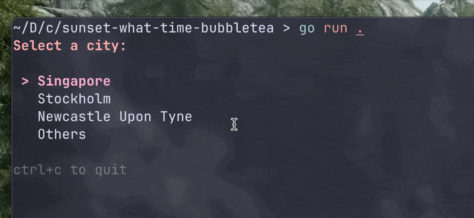

# Sunset Time Finder TUI

A small Go portfolio project built with Bubble Tea that lets users look up the local sunset time for a city from the terminal.

This app combines a lightweight terminal UI, fuzzy city search, geocoding, timezone mapping, and live sunset data into a simple interactive experience.

## Demo



## Overview

Users can choose from a short list of preset cities or type their own. The app then:

- finds the city's coordinates with the OpenCage Geocoding API
- maps those coordinates to the correct timezone
- fetches sunset time data from the Sunrise-Sunset API
- converts the result from UTC into the city's local time
- displays the final answer in a styled terminal interface

## Features

- Terminal UI built with Bubble Tea
- Styled output with Lip Gloss
- Preset city selection for quick testing
- Custom city input with fuzzy suggestions
- Real-time API integration
- Local timezone conversion for accurate sunset times
- Basic loading and error states

## Tech Stack

- Go
- Bubble Tea
- Lip Gloss
- OpenCage Geocoding API
- Sunrise-Sunset API
- `timezonemapper` for timezone lookup


## Running Locally

1. Clone the repository.
2. Install dependencies:

```bash
go mod download
```

3. Create a `.env` file in the project root:

```env
OPENCAGE_API_KEY=your_api_key_here
```

4. Start the app:

```bash
go run .
```

## Project Structure

```text
.
├── main.go              # Bubble Tea app flow and UI state
├── styles.go            # Lip Gloss styling
├── cities.go            # Preset and searchable city list
├── geocode/
│   └── geocode.go       # OpenCage geocoding integration
└── sunset/
    └── sunset.go        # Sunrise-Sunset API integration
```

## Possible Next Steps

- Add sunrise time and daylight duration
- Add unit tests for API and time conversion logic
- Cache recent city lookups
- Package the app as a downloadable binary
